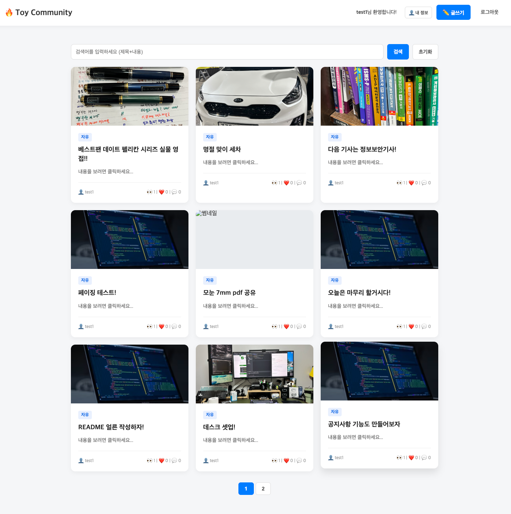
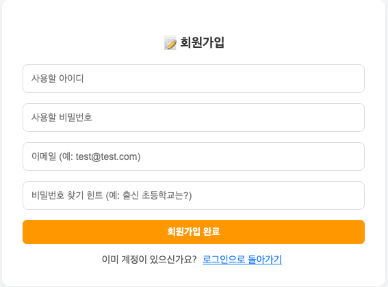
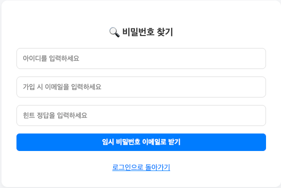
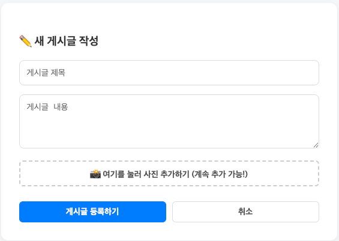
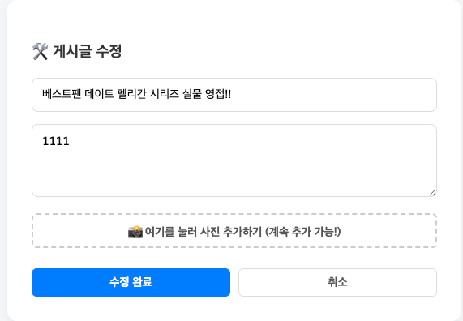
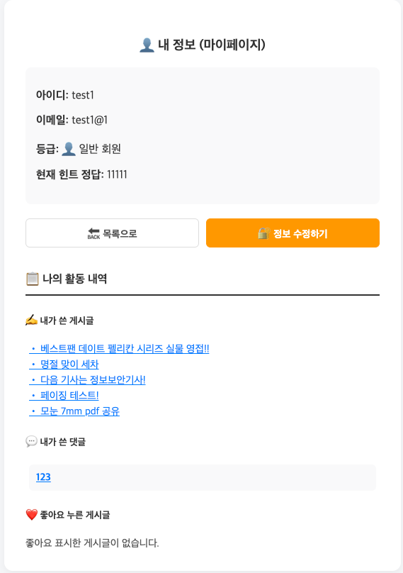
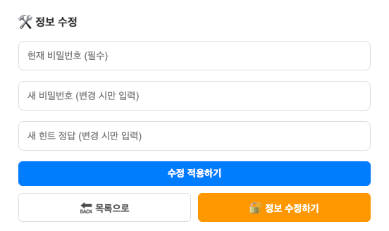

# 🔥 Toy Community Project

> 🎯 **"백엔드 성능 최적화부터 프론트엔드 UX까지, 1인 풀사이클(Full-Cycle)로 완성한 커뮤니티 플랫폼"**
>
> 단순히 API만 만드는 것을 넘어, **Vanilla JS 기반의 SPA(Single Page Application) 프론트엔드**를 직접 구현하여 클라이언트와의 연동을 검증했습니다.
> AWS S3 파일 스토리지, Redis를 활용한 성능 개선 및 보안, GitHub Actions를 통한 CI/CD 무중단 배포까지 실제 서비스와 동일한 인프라를 구축했습니다.

🔗 **실제 서비스 접속해 보기:** [http://rkqkdrnportfolio.shop:8082/](http://rkqkdrnportfolio.shop:8082/)

 

## 🛠️ Tech Stack & Architecture

### Tech Stack
- **Backend:** Java 21, Spring Boot 3.x, Spring Data JPA, Spring Security, JWT
- **Frontend:** HTML5, CSS3, Vanilla JavaScript (ES6), Fetch API
- **Database & Storage:** MySQL (Prod), H2 (Local), Redis, AWS S3
- **Infrastructure:** AWS EC2, GitHub Actions, SCP (배포 자동화)

### System Architecture
- **Client:** 외부 라이브러리(React, Vue 등) 의존 없이 브라우저 핵심 API와 DOM을 직접 제어하여 성능 최적화
- **Server:** RESTful API 설계 및 Security 필터 단의 안전한 JWT 검증 로직 통과
- **Storage:** - 정형 데이터(게시글, 유저)는 **MySQL**에 영속화
    - 휘발성/빈번한 접근 데이터(Refresh Token, 조회수)는 **Redis**에 인메모리 캐싱
    - 고용량 미디어 파일(이미지, PDF)은 **AWS S3**에 분리 저장

 

## 💡 주요 기술적 의사결정 및 트러블 슈팅

### 1. 🌐 프론트엔드 프레임워크 대신 Vanilla JS 선택 및 SPA 구현
> **"기본기 탄탄한 개발자로 성장하기 위한 의도적인 제약"**

* **🎯 목적:** React 등 프레임워크에 의존하기 전, 브라우저 렌더링 원리와 비동기 통신(`Fetch API`)의 본질을 이해
* **🛠️ 구현:** 라이브러리 없이 순수 JavaScript(ES6)만으로 DOM 직접 조작, LocalStorage 기반 JWT 토큰 관리 및 SPA(Single Page Application) 라우팅 로직 구현
* **📈 성과:** 클라이언트-서버 간의 HTTP 통신 흐름과 JWT 인증 사이클을 체득 및 불필요한 번들 사이즈 감소

 

### 2. 🔐 사용자 경험(UX)을 살리는 스마트 토큰 갱신 (RTR 기법)
> **🚨 Issue:** 보안을 위해 Access Token 만료 시간을 짧게 설정하자, 글 작성 중 토큰이 만료되어 **데이터가 증발하고 강제 로그아웃되는 심각한 UX 저하** 발생

* **💡 Resolution:**
    * 공통 비동기 통신 래퍼 함수인 `fetchWithAuth` 구현
    * `401 Unauthorized` 에러 발생 시, 사용자에게 에러를 띄우기 전 백그라운드에서 `/reissue` API를 은밀히 호출
    * Redis의 Refresh Token과 대조하여 새 토큰 발급 후, **실패했던 기존 요청을 자동 재실행**
* **📈 성과:** 최고 수준의 보안(RTR)을 유지하면서도, 사용자는 토큰 만료를 전혀 눈치채지 못하는 매끄러운 UX 제공

 

### 3. ☁️ S3 리소스 최적화 및 데이터 보존을 위한 '투트랙(Two-Track)' 전략
> **🚨 Issue:** 게시글 수정/삭제 시 S3에 업로드된 물리 파일들을 어떻게 처리할 것인지 정책이 없으면, **비용이 낭비(좀비 데이터)되거나 중요한 데이터가 영구 유실될 위험**이 존재

* **💡 Resolution:**
    * **수정(Update) 시 - 비용 최적화:** 새로운 사진으로 교체될 때, 기존 S3 객체의 URL을 추적하여 `deleteObject` API를 선제 호출해 즉시 삭제. 불필요한 과거 사진이 쌓이는 것을 차단.
    * **삭제(Delete) 시 - 보존력 확보:** DB에서 즉시 날리지 않고 `isDeleted = true` 상태로 변경하는 **Soft Delete** 적용. 실수로 지운 데이터의 복구 기회를 제공하고 증거 인멸을 방지하기 위해 S3 파일도 즉시 삭제하지 않고 유지.
* **🚀 Future Plan (도입 예정):** Spring Scheduler를 활용하여, Soft Delete 처리된 지 30일이 지난 게시글과 연결된 S3 물리 파일을 일괄 영구 삭제(Hard Delete)하는 자동화 배치 로직을 추가하여 리소스 최적화를 고도화할 예정.
* **📈 성과:** 스토리지 누수를 막는 '비용 최적화'와 서비스 운영 안정성을 위한 '데이터 복원력'을 동시에 확보

 

### 4. ⚡ 조회수 동시성 문제 및 어뷰징 방지 (Redis 도입)
> **🚨 Issue:** 악의적인 사용자의 **F5(새로고침) 연타 시 무의미한 조회수 Update 쿼리가 폭주**하여 DB 병목 및 데이터 오염 발생

* **💡 Resolution:**
    * 디스크 I/O가 발생하는 RDBMS 대신, 빠른 속도를 보장하는 인메모리 캐시 시스템 **Redis** 전격 도입
    * `view:post:{postId}:ip:{clientIp}` 형태의 고유 식별 키를 생성하고 **24시간의 만료 시간(TTL)** 부여
* **📈 성과:** 무의미한 DB 쿼리 발생을 막아 서버 부하를 획기적으로 낮추고, 특정 사용자의 조회수 조작 원천 차단

 

### 5. 🚀 GitHub Actions 기반 CI/CD 자동 배포 파이프라인
> **🚨 Issue:** 기능 추가 시마다 수동으로 빌드 파일을 전송하고 서버를 재시작하면서 **휴먼 에러 발생 및 개발 흐름 단절**

* **💡 Resolution:**
    * `main` 브랜치 Push 시 **GitHub Actions**가 자동 빌드 수행
    * SCP를 통해 AWS EC2 환경으로 빌드(jar) 파일 안전하게 전송
    * 쉘 스크립트(`deploy.sh`)를 통해 기존 서버 프로세스 안전 종료 후 새 서버 백그라운드(`nohup`) 무중단 실행
* **📈 성과:** 배포 소요 시간 90% 이상 단축 및 온전히 비즈니스 로직 고도화에만 집중할 수 있는 DevOps 환경 구축

 

## 📌 주요 화면 (Screenshots)

 🌌 화면 캡처 보기 (클릭하여 펼치기) 

### 1. 메인 및 게시글 목록

- **카드형 레이아웃:** 3x3 그리드 방식의 트렌디한 목록 UI, 카테고리 뱃지(공지/자유/질문) 및 동적 페이징 처리

---

### 2. 회원가입 및 보안 (Auth)
| 회원가입 | 비밀번호 찾기 |
| :---: |:---:|
|  | |
- **보안 강화:** 회원가입 시 비밀번호 찾기 힌트를 설정하며, 이메일을 통한 임시 비밀번호 발급 기능 제공

---

### 3. 게시글 관리 (Post Management)
| 게시글 작성 (다중 이미지/PDF) | 게시글 수정 (동적 UI) |
|:---:|:---:|
|||
- **파일 첨부:** 장바구니 형태의 파일 누적 추가 및 개별 삭제(X버튼) 지원
- **카테고리:** 관리자 전용 '공지' 작성 및 일반 유저의 '자유/질문' 분류 기능

---

### 4. 마이페이지 (My Page)
| 활동 내역 요약 | 내 정보 수정 |
|:---:|:---:|
|||
- **통합 조회:** 내가 쓴 글, 작성한 댓글, 좋아요 누른 게시글을 한곳에서 모아보기 가능
- **보안 검증:** 비밀번호 변경 시 현재 비밀번호 확인 필수

---

최근 업데이트 2026.03.10 -README V1.0.0 최종 작성